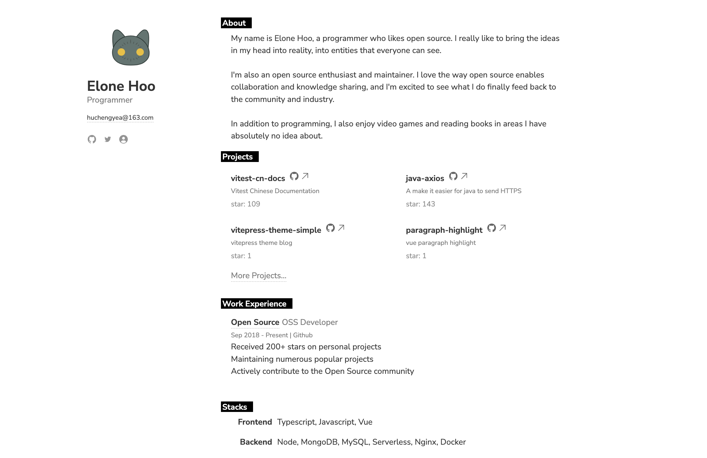

<h1 align='center'>
Résumé
</h1>

## What is resume？

The imitated project is [resume](https://github.com/antfu/resume) of [Anthony Fu](https://github.com/antfu)

[Live Demo](https://resume.elonehoo.xyz/)

## How to modify

Modify "src/resume.json" to complete your own configuration.
